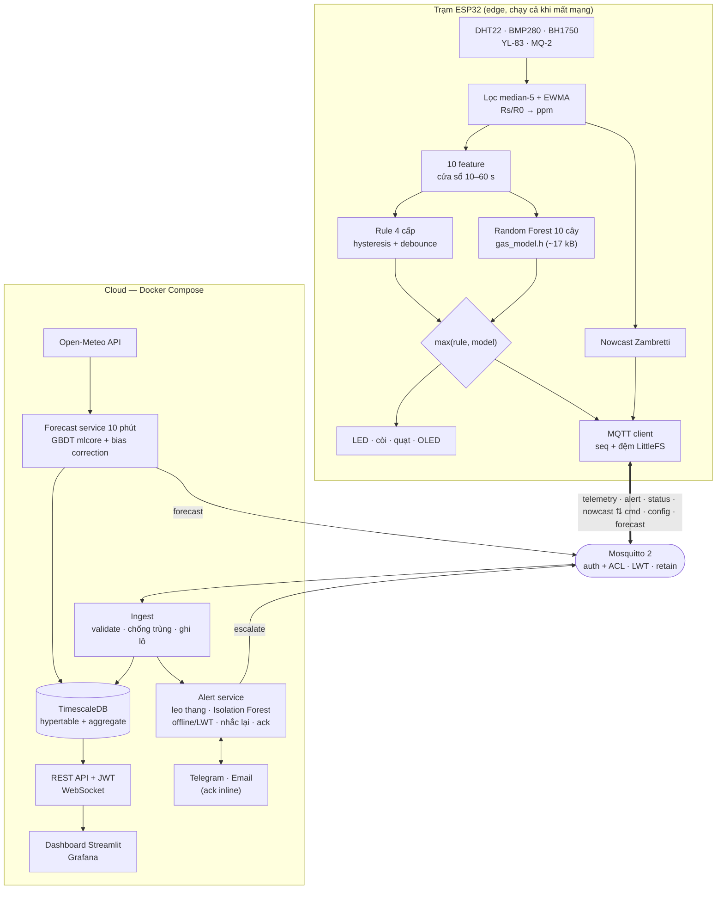
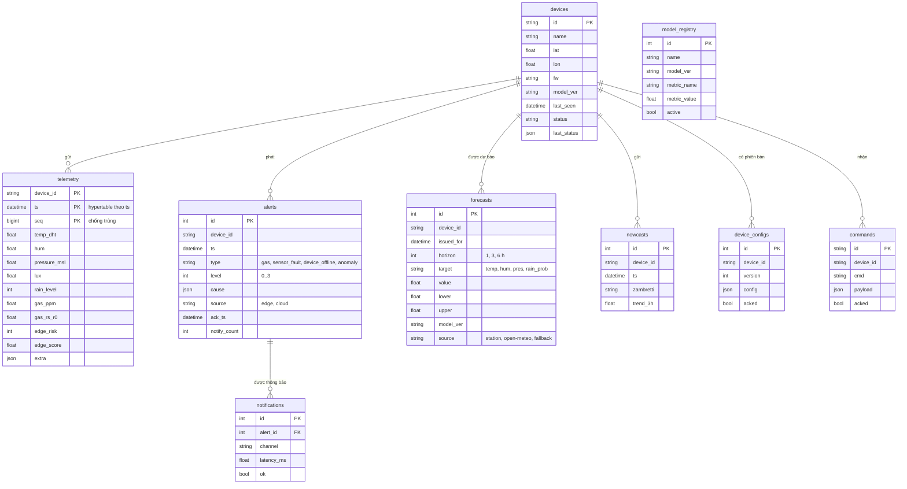

# Sơ đồ kiến trúc và CSDL

Ảnh PNG sinh bằng `node tools/render_mermaid.js` → `docs/report/figures/diagrams/`.

## Kiến trúc tổng thể (AI lai edge–cloud)

```mermaid
flowchart TB
    subgraph EDGE["Trạm ESP32 (edge, chạy cả khi mất mạng)"]
        direction LR
        SEN["DHT22 · BMP280 · BH1750<br/>YL-83 · MQ-2"] --> FIL["Lọc median-5 + EWMA<br/>Rs/R0 → ppm"]
        FIL --> FEAT["10 feature<br/>cửa sổ 10–60 s"]
        FEAT --> RULE["Rule 4 cấp<br/>hysteresis + debounce"]
        FEAT --> TREE["Random Forest 10 cây<br/>gas_model.h (~17 kB)"]
        RULE --> FUS{"max(rule, model)"}
        TREE --> FUS
        FUS --> ACT["LED · còi · quạt · OLED"]
        FIL --> ZAM["Nowcast Zambretti"]
        FUS --> TX["MQTT client<br/>seq + đệm LittleFS"]
        ZAM --> TX
    end
    TX <== "telemetry · alert · status · nowcast ⇅ cmd · config · forecast" ==> MQ(["Mosquitto 2<br/>auth + ACL · LWT · retain"])
    subgraph CLOUD["Cloud — Docker Compose"]
        direction LR
        ING["Ingest<br/>validate · chống trùng · ghi lô"] --> DB[("TimescaleDB<br/>hypertable + aggregate")]
        ING --> ALS["Alert service<br/>leo thang · Isolation Forest<br/>offline/LWT · nhắc lại · ack"]
        OM["Open-Meteo API"] --> FCS["Forecast service 10 phút<br/>GBDT mlcore + bias correction"]
        FCS --> DB
        DB --> API["REST API + JWT<br/>WebSocket"] --> DASH["Dashboard Streamlit<br/>Grafana"]
        ALS <--> TG["Telegram · Email<br/>(ack inline)"]
    end
    MQ --> ING
    ALS -- escalate --> MQ
    FCS -- forecast --> MQ
```

## Lược đồ CSDL (ERD)

```mermaid
erDiagram
    devices ||--o{ telemetry : "gửi"
    devices ||--o{ alerts : "phát"
    devices ||--o{ forecasts : "được dự báo"
    devices ||--o{ nowcasts : "gửi"
    devices ||--o{ device_configs : "có phiên bản"
    devices ||--o{ commands : "nhận"
    alerts ||--o{ notifications : "được thông báo"
    devices {
        string id PK
        string name
        float lat
        float lon
        string fw
        string model_ver
        datetime last_seen
        string status
        json last_status
    }
    telemetry {
        string device_id PK
        datetime ts PK "hypertable theo ts"
        bigint seq PK "chống trùng"
        float temp_dht
        float hum
        float pressure_msl
        float lux
        int rain_level
        float gas_ppm
        float gas_rs_r0
        int edge_risk
        float edge_score
        json extra
    }
    alerts {
        int id PK
        string device_id
        datetime ts
        string type "gas, sensor_fault, device_offline, anomaly"
        int level "0..3"
        json cause
        string source "edge, cloud"
        datetime ack_ts
        int notify_count
    }
    forecasts {
        int id PK
        string device_id
        datetime issued_for
        int horizon "1, 3, 6 h"
        string target "temp, hum, pres, rain_prob"
        float value
        float lower
        float upper
        string model_ver
        string source "station, open-meteo, fallback"
    }
    nowcasts {
        int id PK
        string device_id
        datetime ts
        string zambretti
        float trend_3h
    }
    device_configs {
        int id PK
        string device_id
        int version
        json config
        bool acked
    }
    commands {
        string id PK
        string device_id
        string cmd
        json payload
        bool acked
    }
    model_registry {
        int id PK
        string name
        string model_ver
        string metric_name
        float metric_value
        bool active
    }
    notifications {
        int id PK
        int alert_id FK
        string channel
        float latency_ms
        bool ok
    }
```
