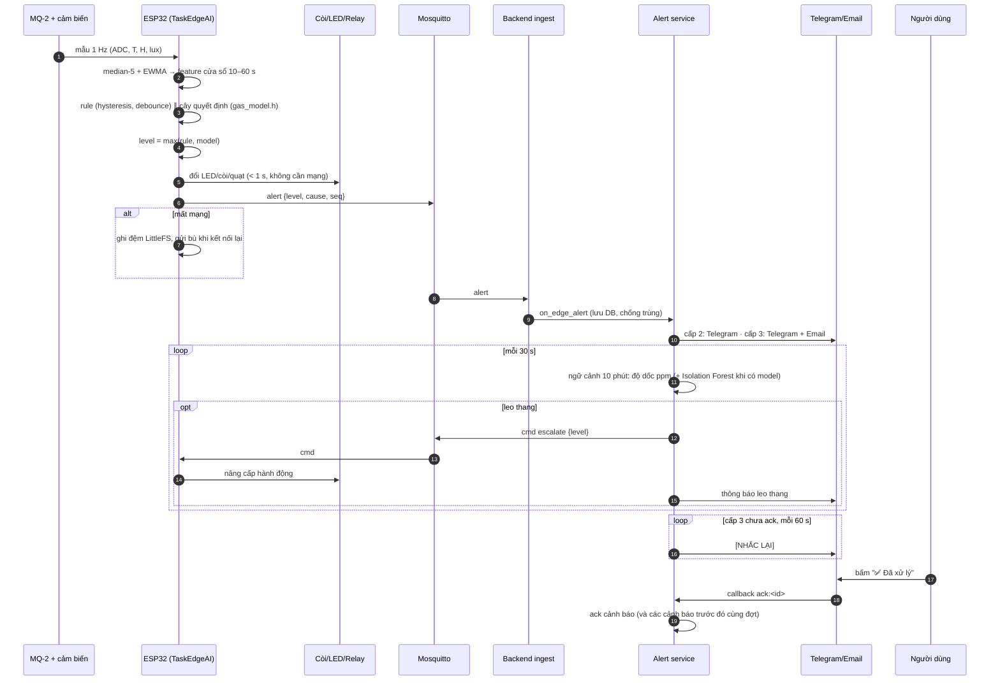
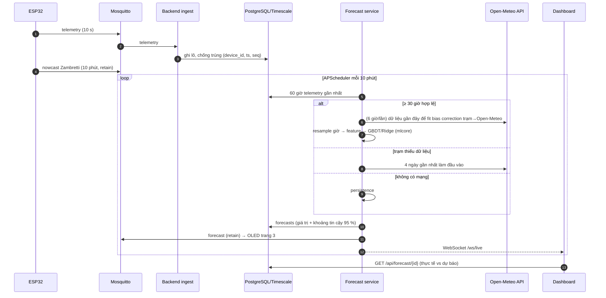
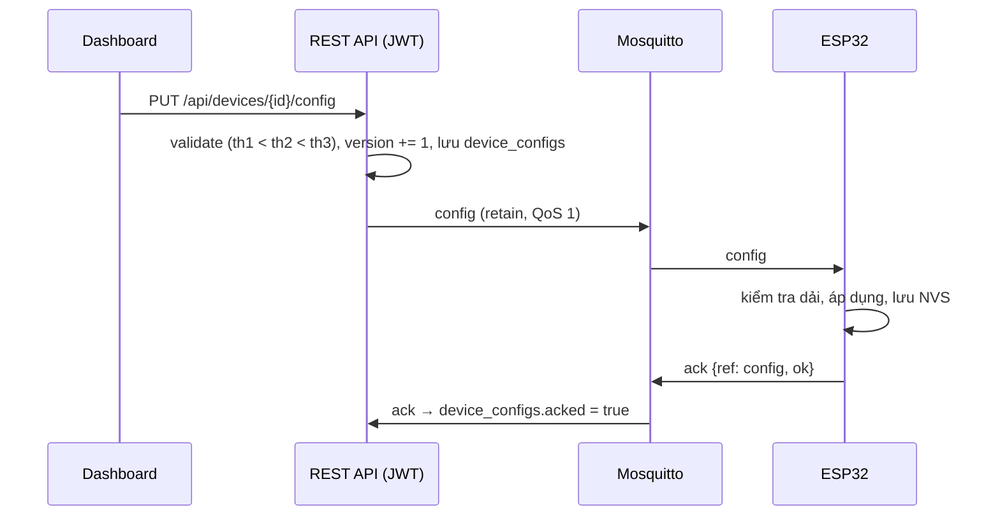

# Sơ đồ tuần tự

## Luồng cảnh báo khí/khói (edge quyết định, cloud xác nhận & leo thang)

```mermaid
sequenceDiagram
    autonumber
    participant S as MQ-2 + cảm biến
    participant E as ESP32 (TaskEdgeAI)
    participant A as Còi/LED/Relay
    participant B as Mosquitto
    participant I as Backend ingest
    participant AS as Alert service
    participant T as Telegram/Email
    participant U as Người dùng

    S->>E: mẫu 1 Hz (ADC, T, H, lux)
    E->>E: median-5 + EWMA → feature cửa sổ 10–60 s
    E->>E: rule (hysteresis, debounce) ∥ cây quyết định (gas_model.h)
    E->>E: level = max(rule, model)
    E->>A: đổi LED/còi/quạt (< 1 s, không cần mạng)
    E->>B: alert {level, cause, seq}
    alt mất mạng
        E->>E: ghi đệm LittleFS, gửi bù khi kết nối lại
    end
    B->>I: alert
    I->>AS: on_edge_alert (lưu DB, chống trùng)
    AS->>T: cấp 2: Telegram · cấp 3: Telegram + Email
    loop mỗi 30 s
        AS->>AS: ngữ cảnh 10 phút: độ dốc ppm (+ Isolation Forest khi có model)
        opt leo thang
            AS->>B: cmd escalate {level}
            B->>E: cmd
            E->>A: nâng cấp hành động
            AS->>T: thông báo leo thang
        end
    end
    loop cấp 3 chưa ack, mỗi 60 s
        AS->>T: [NHẮC LẠI]
    end
    U->>T: bấm "✅ Đã xử lý"
    T->>AS: callback ack:<id>
    AS->>AS: ack cảnh báo (và các cảnh báo trước đó cùng đợt)
```

## Luồng dự báo thời tiết

```mermaid
sequenceDiagram
    autonumber
    participant E as ESP32
    participant B as Mosquitto
    participant I as Backend ingest
    participant DB as PostgreSQL/Timescale
    participant F as Forecast service
    participant OM as Open-Meteo API
    participant D as Dashboard

    E->>B: telemetry (10 s)
    B->>I: telemetry
    I->>DB: ghi lô, chống trùng (device_id, ts, seq)
    E->>B: nowcast Zambretti (10 phút, retain)
    loop APScheduler mỗi 10 phút
        F->>DB: 60 giờ telemetry gần nhất
        alt ≥ 30 giờ hợp lệ
            F->>OM: (6 giờ/lần) dữ liệu gần đây để fit bias correction trạm→Open-Meteo
            F->>F: resample giờ → feature → GBDT/Ridge (mlcore)
        else trạm thiếu dữ liệu
            F->>OM: 4 ngày gần nhất làm đầu vào
        else không có mạng
            F->>F: persistence
        end
        F->>DB: forecasts (giá trị + khoảng tin cậy 95 %)
        F->>B: forecast (retain) → OLED trang 3
        F-->>D: WebSocket /ws/live
    end
    D->>DB: GET /api/forecast/{id} (thực tế vs dự báo)
```

## Luồng cấu hình thiết bị

```mermaid
sequenceDiagram
    participant D as Dashboard
    participant API as REST API (JWT)
    participant B as Mosquitto
    participant E as ESP32
    D->>API: PUT /api/devices/{id}/config
    API->>API: validate (th1 < th2 < th3), version += 1, lưu device_configs
    API->>B: config (retain, QoS 1)
    B->>E: config
    E->>E: kiểm tra dải, áp dụng, lưu NVS
    E->>B: ack {ref: config, ok}
    B->>API: ack → device_configs.acked = true
```
